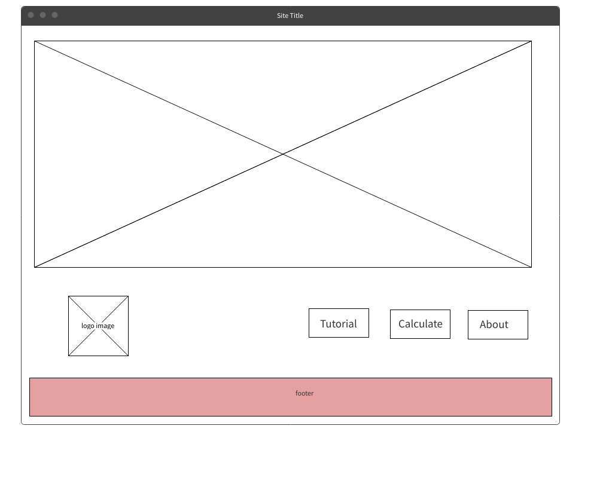
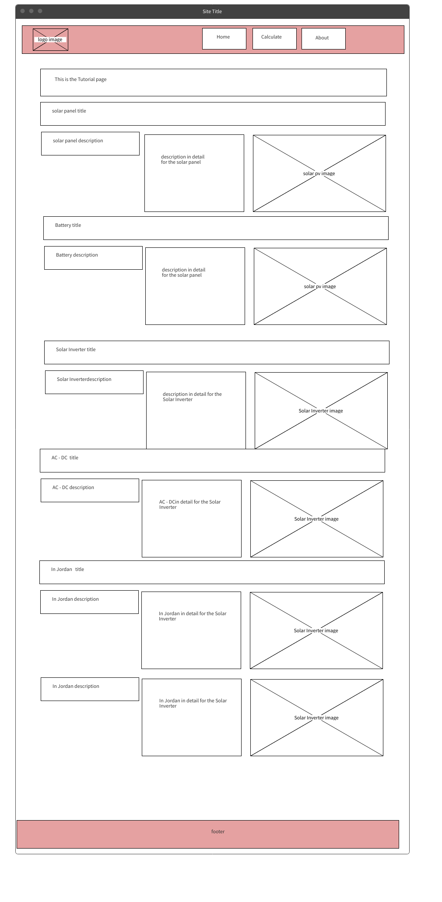
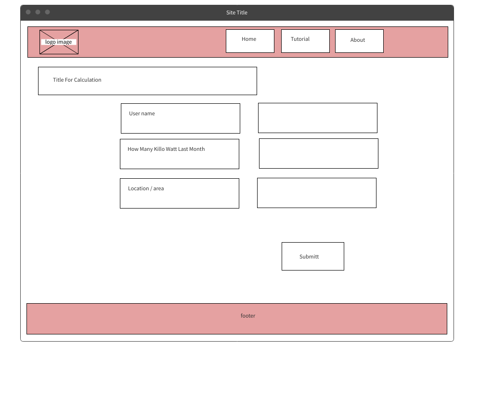
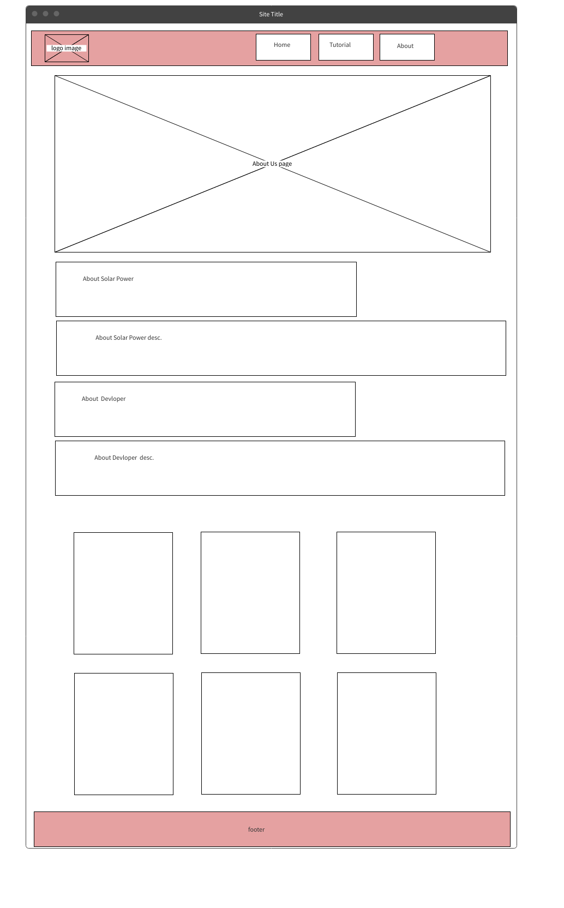

# solar-power

## Collaborators

1. Osama Omar
2. Anas Ahmad
3. Ehab Ahmad
4. Dina Abuzain
5. Farah Asha
6. Basel Almousa

## Problem Domain:

Currently, Jordan market needs to know more about the solar energy regarding to the tools that needed to calculate the solar power based on the electricity consumption and we will provide in this project different cataloges so the custumer will be able to select upon the budget and needs.

# WireFrame

We craet wireframe and planed how our webiste will display, and this images for our wireframe :

[Home Page](../solar-power/index.html)

> It's the main page for our website so it's contain a hero image and the logo icon on the end and you can found the link of another pages on the our website

[Tutorial Page]()

> We have header on the top we have some section with images :

* title for one of sections
* Solar panel title
* solar panel discriptions and another to details
* image related solar panel discriptions
* Battary title and another to details
* image related Battary title
* Solar inverter and another to details
* image related Solar inverter
* Ac/Dc discriptions and another to details
* image related Ac/Dc
* In Jordan solar power and another to details
* image related Ac/Dc

[Calculation page]()

> Here we creat a calculation page to calaculate how much user need amount of -Wat- to git it in his house or company and we have a form to tell user what should he enter requrmint to equation calculate and after this we have a buttom calculate to show the result for the user using box details and chart, on the top we have a header and after this we have some information about instruction to use this solar power etc..
and finally we have on the end footer.

[About Page]()

> We have header on the top it contain logo from left and from the right we have a links for pages and after this we have a hero image and we have some details:

* about solar power
* about solar power description
* about developer
* about developer description

and finally here are the solar commanders members,and the footer

-----